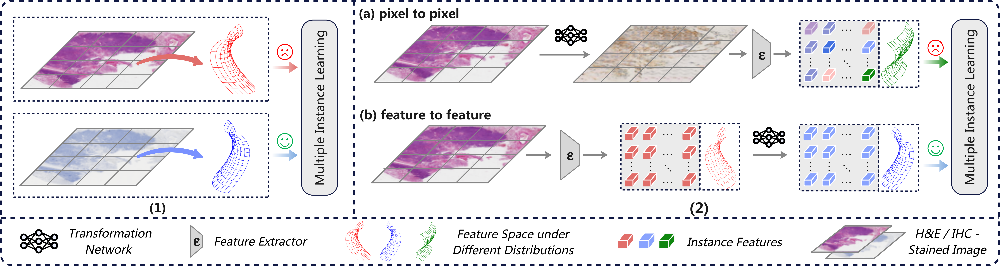
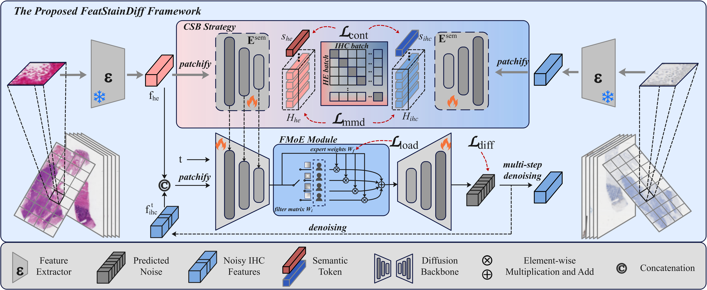

DCFT / FeatStainDiff
=====================

Official code repository for the Medical Image Analysis article
"Diffusion-based cross-staining feature transformation for whole slide image
analysis: From H&E to IHC representation learning."

Paper: https://doi.org/10.1016/j.media.2026.104138

Overview
--------

FeatStainDiff maps H&E patch features to IHC-like patch features with a
conditional diffusion model. It works with embeddings from a frozen feature
extractor and does not synthesize IHC pixels.

* Contrastive Semantic Bridging (CSB) aligns pathology semantics across the
  two staining modalities.
* Frequency-domain Mixture of Experts (FMoE) adapts the denoising features
  across frequency bands.

The project owner confirmed the full local code as the final version.
The public repository temporarily omits the core model implementation
featstaindiff/model.py for a final review. Training, inference, and test
scripts are present for inspection, but cannot run from the public checkout
until that file is added. The paired-feature packing script runs
independently. Patient data, feature files, pretrained extractor weights,
and trained checkpoints are not distributed here. The numerical results in
the article have not been independently rerun with this release.

Quick start
-----------

The commands below document the complete workflow once model.py is released.
At present, step 2 (paired-feature preparation) runs independently.

1. Create an environment with Python 3.10 or newer and PyTorch 2.5 or newer.
   Install the package::

       python -m pip install -e .

   The author's local Conda environment is named AI4M::

       conda activate AI4M
       python -m pip install -e .

2. Prepare spatially paired H&E and IHC feature matrices. Each row must
   represent the same tissue location in both matrices. If the extractor
   saves one floating-point .pt tensor per patch in matching directory
   trees, pack the paired files::

       python scripts/pack_pairs.py \
         --he-dir /path/to/he_patches \
         --ihc-dir /path/to/ihc_patches \
         --he-output /path/to/he_features_with_ids.npz \
         --ihc-output /path/to/ihc_features_with_ids.npz

3. Set the paired paths and train::

       HE_FEATURES=/path/to/he_features_with_ids.npz \
       IHC_FEATURES=/path/to/ihc_features_with_ids.npz \
       bash train.sh

4. Generate IHC-like features from H&E features::

       python -m featstaindiff.infer \
         --checkpoint runs/default/checkpoints/last.pt \
         --input /path/to/he_features.npy \
         --output /path/to/generated_ihc_features.pt \
         --steps 30 \
         --ensemble 5

Use bash train.sh --help, python -m featstaindiff.train --help, and
python -m featstaindiff.infer --help to inspect all options.

Data and training details
-------------------------

The model consumes feature matrices shaped (number_of_patches, feature_dim).
Supported inputs are .pt/.pth feature tensors or dictionaries containing
features and ids, .npy matrices without IDs, and .npz archives containing
features and optional ids. Training requires matching IDs in the same row
order when IDs are present in both files. If only one file has IDs, it
fails. For two ID-free arrays, set ASSUME_ALIGNED_ORDER=1 only after
independently verifying matching row order. The paired width must match
--feature-dim.

The article's WSI experiments used non-overlapping 512 x 512 pixel patches
with CLAM, and RegWSI registration for IMPRESS and NSCLC H&E/IHC slides.
Registration, tissue selection, frozen feature extraction, patient splits,
and downstream MIL training are separate preparation steps. The packer
checks filenames, shapes, and finite values; matching filenames alone
do not prove registration. Review archived IDs for patient identifiers
before sharing data.

The article reports AdamW with learning rate 5e-5 for 150,000 optimizer
steps, four experts, and contrastive/MMD/load loss weights of
1.0/0.5/0.1. The code also exposes model width/depth, feature-axis token
width, semantic depth, diffusion schedule, batch size, weight decay,
gradient clipping, EMA decay, seed, and device. Save the exact
configuration used in each run; the paper does not specify every value.

The training launcher uses the active Python environment. Set
CONDA_ENV=AI4M to activate that environment explicitly, or set another
Conda environment name. Set SKIP_CONDA_ACTIVATE=1 to bypass activation
and OUTPUT_DIR to change the default runs/default output path. Additional
arguments are passed to the training CLI.

Training saves runs/default/checkpoints/last.pt by default. Resume from
that checkpoint with --resume and a higher --max-steps using the same data
paths, seed, batch size, and training settings. An existing output
checkpoint may be resumed only from itself. CUDA training supports
--amp fp16 and --amp bf16; fp16 overflows retry the same batch and
diffusion noise before an optimizer step or EMA update advances.

Inference and evaluation
------------------------

Inference accepts one feature file or a directory of .pt, .pth, .npy,
and .npz files. It writes .pt tensors in the original row order, retaining
the input basename when processing a directory. Use --preserve-ids to
save a features/ids dictionary when source IDs exist. Existing outputs
require --overwrite; input files and checkpoints are protected from
replacement.

The article uses 30-step DDIM sampling and averages five noise draws.
A checkpoint must have been trained for the same extractor and feature
width as the input. For MIST-to-TCGA-BRCA transfer, pass
--combine-with-input to add the generated features to the H&E features
before downstream MIL.

Reproducing article metrics also requires the original registered data,
extractor checkpoints, patient splits, feature preprocessing, MAE/PCC
aggregation, and MIL evaluation protocol. These artifacts are not bundled
here. Current CLI defaults include feature width 1024, hidden width 384,
depth 6, eight attention heads, feature-axis token width 16, batch size
32, contrastive temperature 0.1, continuous VP beta endpoints 0.1 and
20.0, AdamW weight decay 0.03, and EMA decay 0.9999. Record the saved
configuration for each experiment.

Repository layout
-----------------

* featstaindiff/: feature loading, diffusion, training, and inference; model.py is temporarily withheld.
* scripts/pack_pairs.py: prepare paired feature archives.
* train.sh: training launcher.
* tests/: synthetic regression and release checks.
* motivation.png and Fig2.png: article motivation and model pipeline.
* CITATION.cff, LICENSE, THIRD_PARTY_NOTICES.txt: citation and licensing.

Checks
------

After model.py is released, run the regression suite::

    PYTHONDONTWRITEBYTECODE=1 python -m unittest discover -s tests -v

Set FEATSTAINDIFF_TEST_CUDA=1 to include fp16/bf16 GPU checks. These
tests cover gradients, sampling, resume consistency, and output
protection using temporary synthetic features. They do not measure
the article's published results.

Citation and license
--------------------

Please cite Zhong et al., Medical Image Analysis 112 (2026), 104138,
https://doi.org/10.1016/j.media.2026.104138. CITATION.cff contains
machine-readable metadata. The project code is covered by LICENSE;
third-party attribution is in THIRD_PARTY_NOTICES.txt and
licenses/U-ViT-LICENSE.txt. External datasets and pretrained extractors
retain their own distribution terms.
